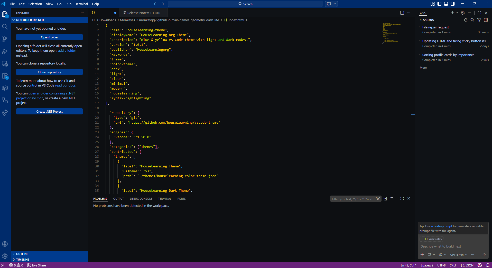

# HouseLearning Theme 

A clean, modern **blue & yellow** Visual Studio Code theme designed for clarity, focus, and a beautiful workspace.

🔵 **Blue headers**  
🟡 **Soft yellow editor background**  
✨ **High contrast, readable, elegant**

---
## Preview


## 📦 Installation

1. Clone the repository:
```git clone https://github.com/houselearning/vscode-theme```
2. Open the folder in VS Code.

3. Press `F5` to launch the Extension Development Host.

4. Select **HouseLearning Theme** from the theme picker.

---

## 📁 Repository

https://github.com/houselearning/vscode-theme

---

## 🎨 Design Philosophy

- Blue UI chrome for structure and clarity  
- Soft yellow editor background for comfort  
- Clean, readable syntax colors  
- Minimalist, modern, HouseLearning‑style aesthetic  

---

Enjoy the theme!
